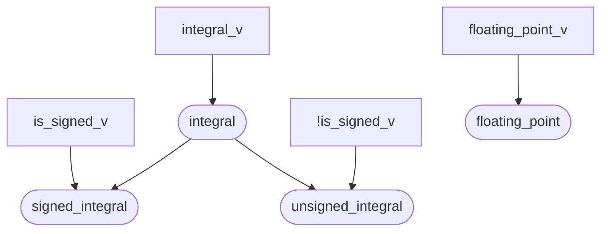
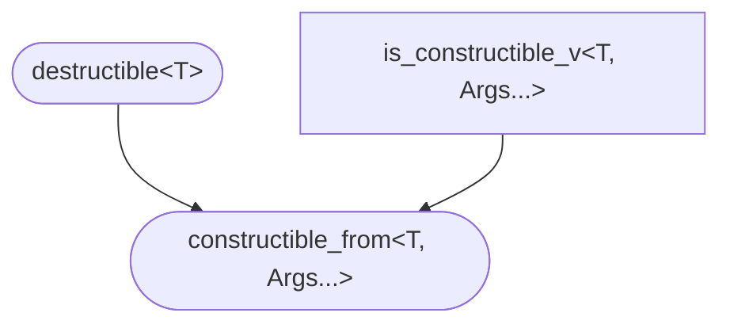
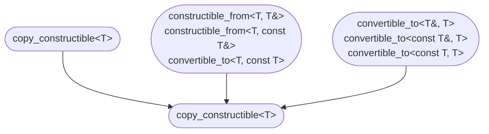
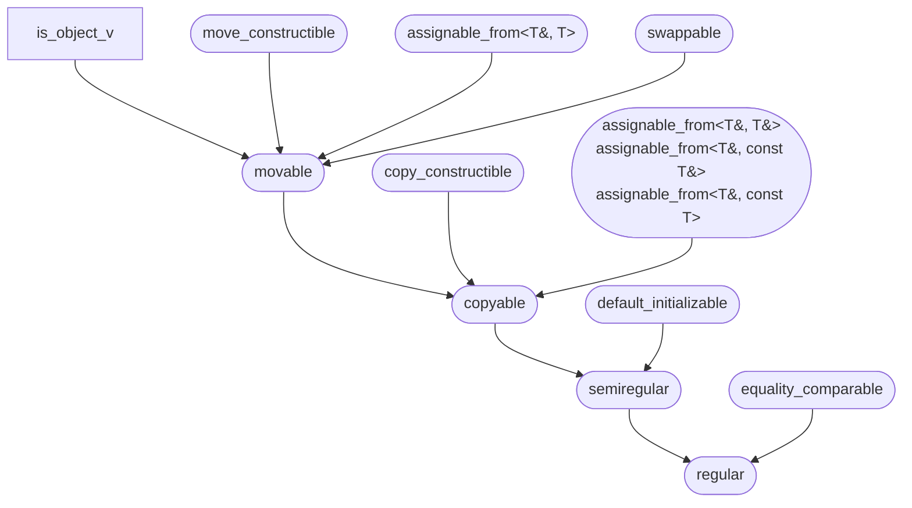

# C++ Standard Concepts

## Arithmetic concepts
https://timsong-cpp.github.io/cppwp/n4868/concepts.arithmetic

## Concept `destructible`
https://timsong-cpp.github.io/cppwp/n4868/concept.destructible

## Concept `constructible_from`
https://timsong-cpp.github.io/cppwp/n4868/concept.constructible

## Concept `default_initializable`
https://timsong-cpp.github.io/cppwp/n4868/concept.default.init

## Concept `move_constructible`
https://timsong-cpp.github.io/cppwp/n4868/concept.moveconstructible

## Concept `copy_constructible`
https://timsong-cpp.github.io/cppwp/n4868/concept.copyconstructible

## Object concepts
https://timsong-cpp.github.io/cppwp/n4868/concepts#object

