# C++ Standard concepts diagrams

## Concept `convertible_to`
https://timsong-cpp.github.io/cppwp/n4868/concept.convertible

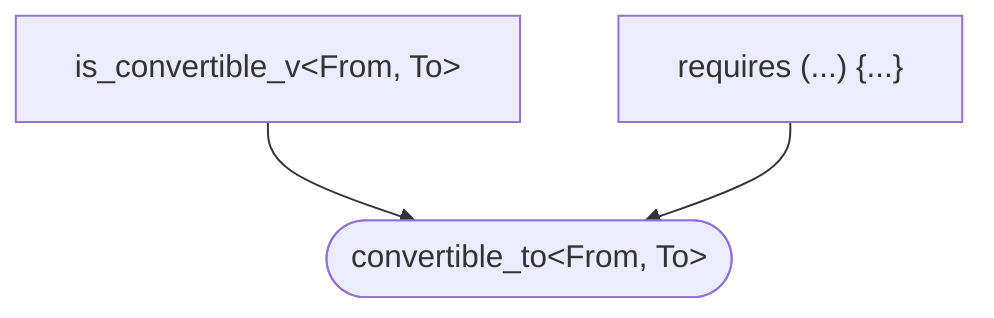

## Concept `common_reference_with`
https://timsong-cpp.github.io/cppwp/n4868/concept.commonref

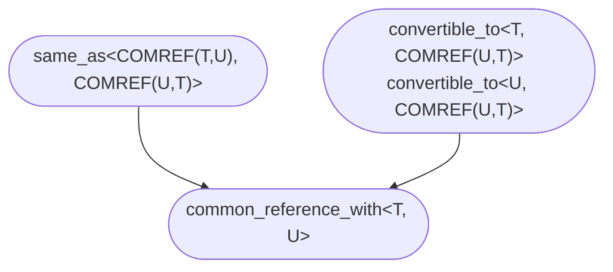

## Concept `common_with`
https://timsong-cpp.github.io/cppwp/n4868/concept.common

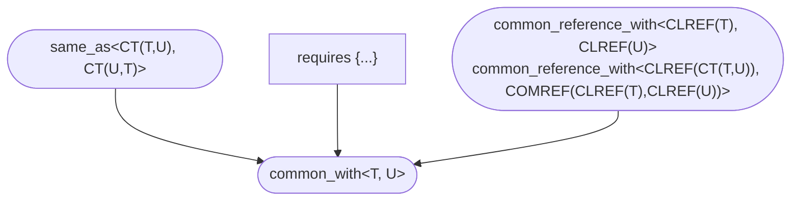

## Arithmetic concepts
https://timsong-cpp.github.io/cppwp/n4868/concepts.arithmetic

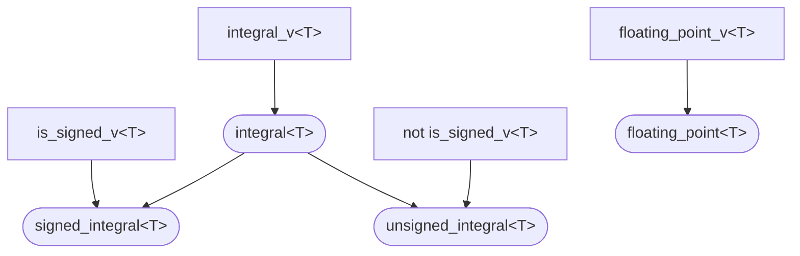

## Concept `assignable_from`
https://timsong-cpp.github.io/cppwp/n4868/concept.assignable

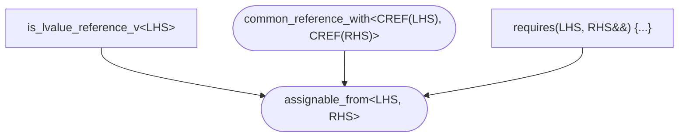

## Concept `swappable`
https://timsong-cpp.github.io/cppwp/n4868/concept.swappable

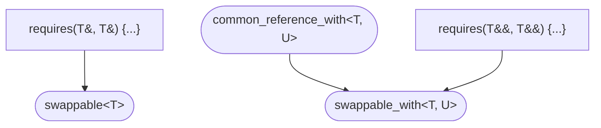

## Concept `destructible`
https://timsong-cpp.github.io/cppwp/n4868/concept.destructible

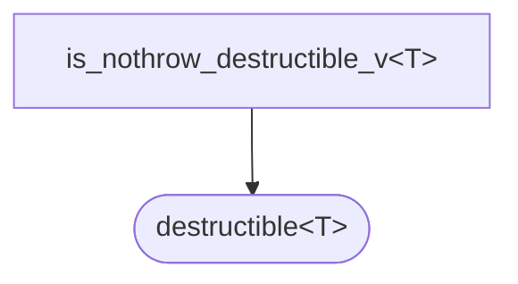

## Concept `constructible_from`
https://timsong-cpp.github.io/cppwp/n4868/concept.constructible

## Concept `default_initializable`
https://timsong-cpp.github.io/cppwp/n4868/concept.default.init

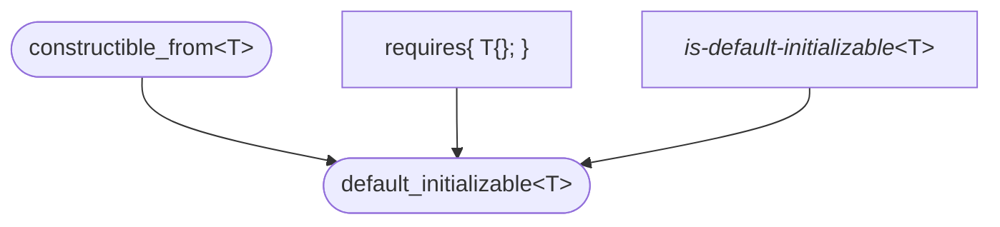

## Concept `move_constructible`
https://timsong-cpp.github.io/cppwp/n4868/concept.moveconstructible

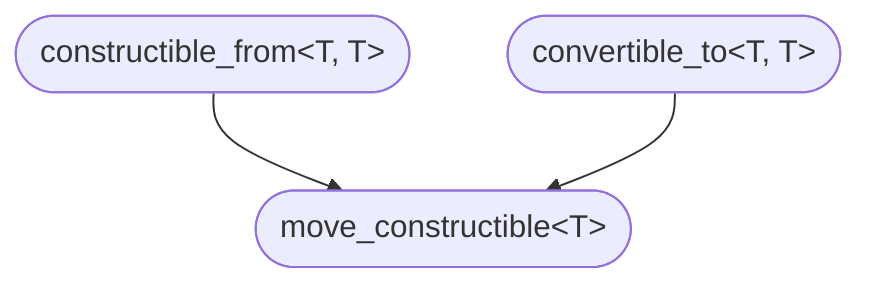

## Concept `copy_constructible`
https://timsong-cpp.github.io/cppwp/n4868/concept.copyconstructible

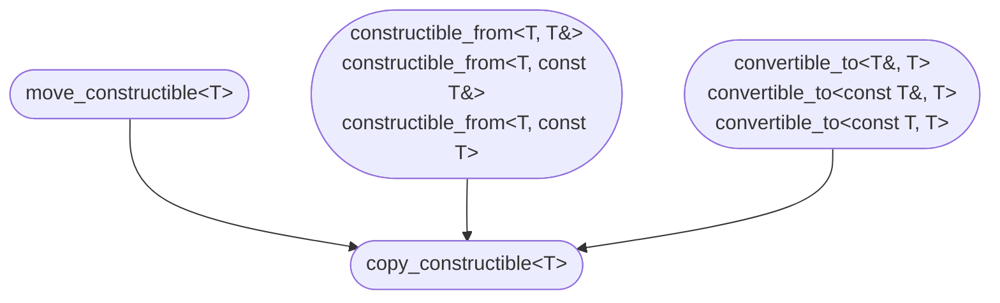

## Boolean testability
https://timsong-cpp.github.io/cppwp/n4868/concept.booleantestable

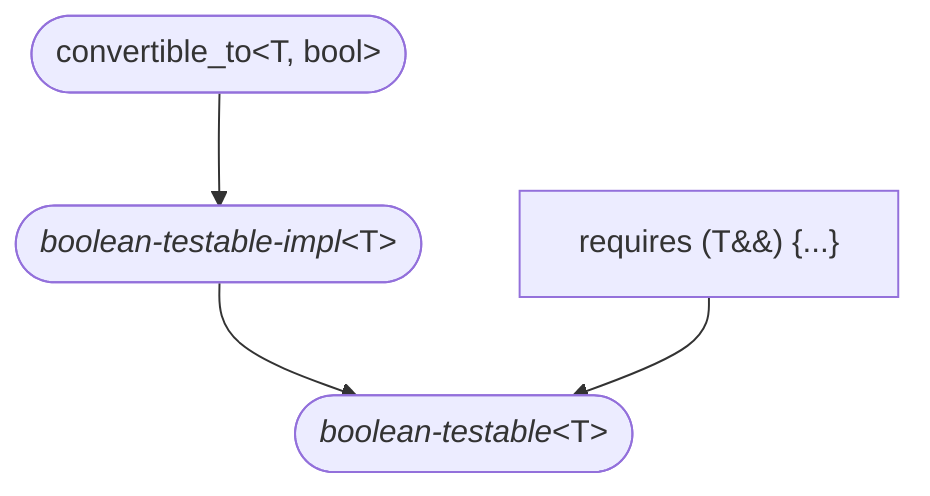

## Concept `equality_comparable`
https://timsong-cpp.github.io/cppwp/n4868/concept.equalitycomparable

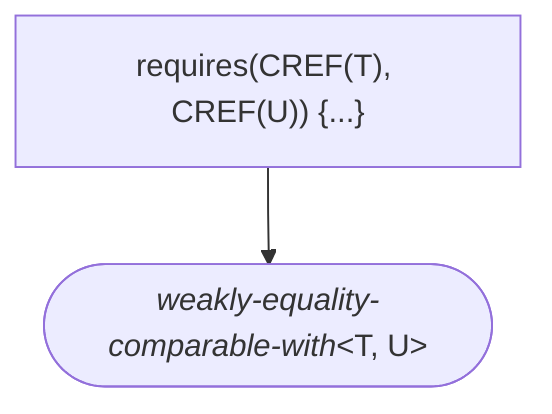

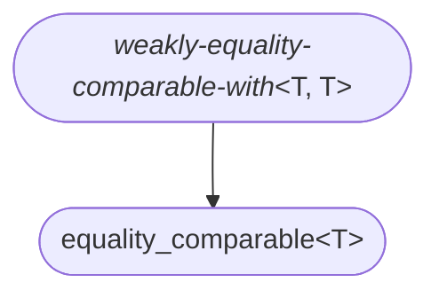

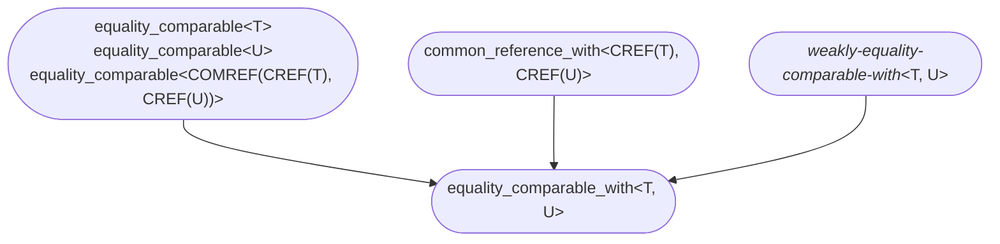

#  Concept `totally_ordered`
https://timsong-cpp.github.io/cppwp/n4868/concept.totallyordered

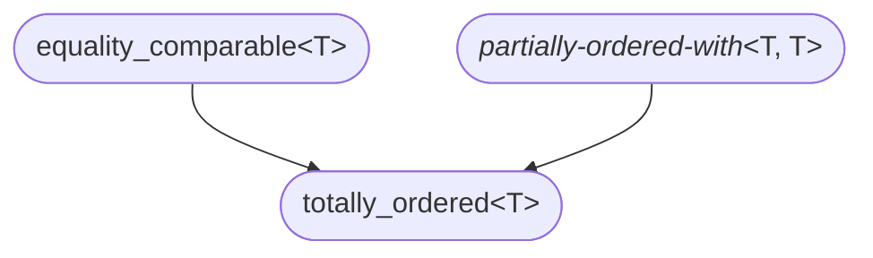

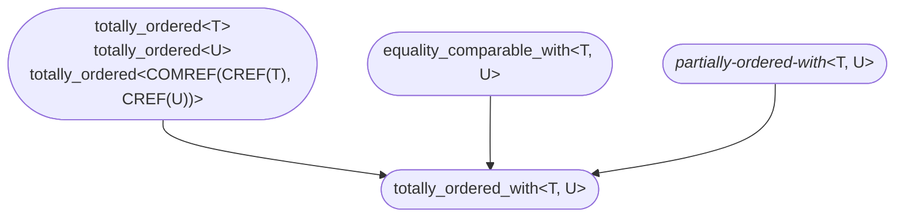

## Object concepts
https://timsong-cpp.github.io/cppwp/n4868/concepts#object

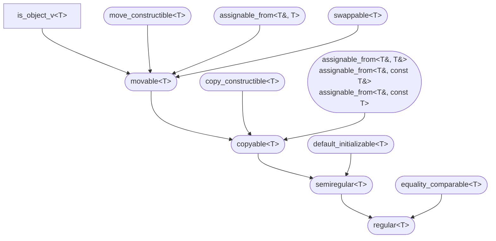
