# C++ Standard concepts diagrams


## Concept `same_as`
https://timsong-cpp.github.io/cppwp/n4868/concept.same

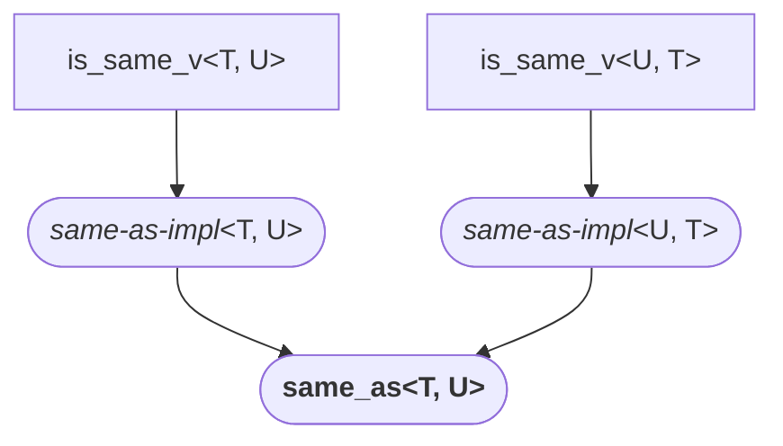
Note: `same_as<T, U>` subsumes `same_as<U, T>`, and `same_as<U, T>` subsumes `same_as<T, U>` for the symmetric subsumption.


## Concept `derived_from`
https://timsong-cpp.github.io/cppwp/n4868/concept.derived

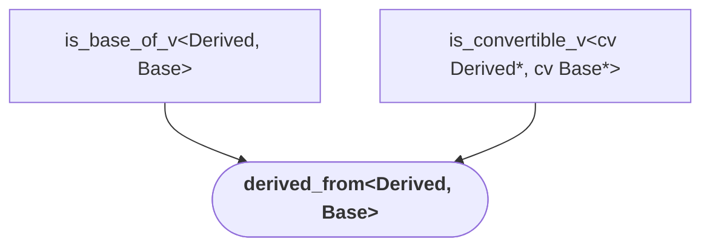
Note: cv = `const volatile`


## Concept `convertible_to`
https://timsong-cpp.github.io/cppwp/n4868/concept.convertible

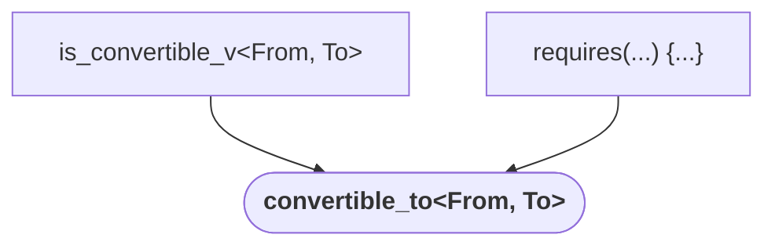


## Concept `common_reference_with`
https://timsong-cpp.github.io/cppwp/n4868/concept.commonref

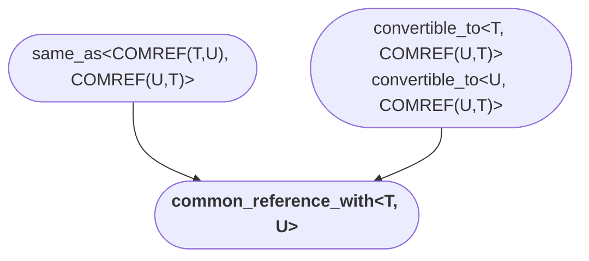


## Concept `common_with`
https://timsong-cpp.github.io/cppwp/n4868/concept.common

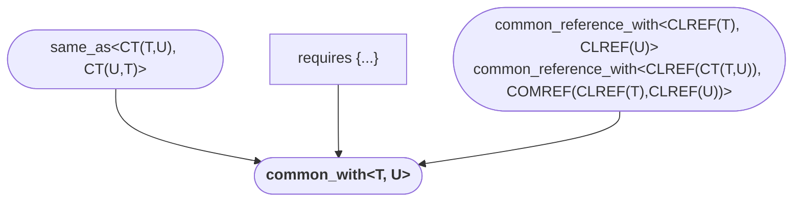


## Arithmetic concepts
https://timsong-cpp.github.io/cppwp/n4868/concepts.arithmetic

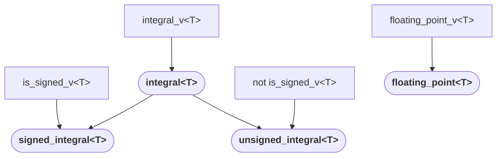


## Concept `assignable_from`
https://timsong-cpp.github.io/cppwp/n4868/concept.assignable

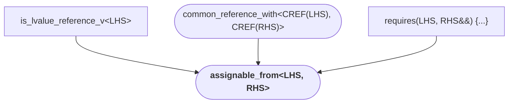


## Concept `swappable`
https://timsong-cpp.github.io/cppwp/n4868/concept.swappable

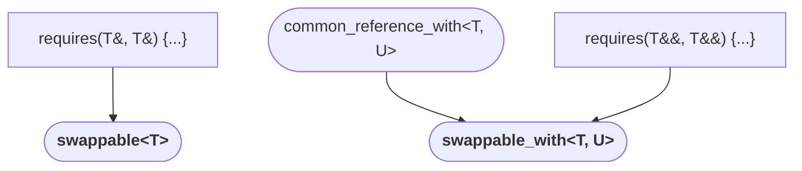


## Concept `destructible`
https://timsong-cpp.github.io/cppwp/n4868/concept.destructible

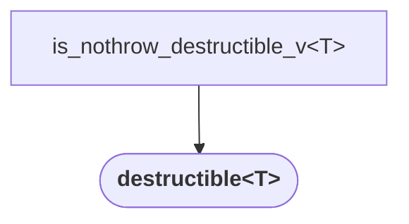


## Concept `constructible_from`
https://timsong-cpp.github.io/cppwp/n4868/concept.constructible

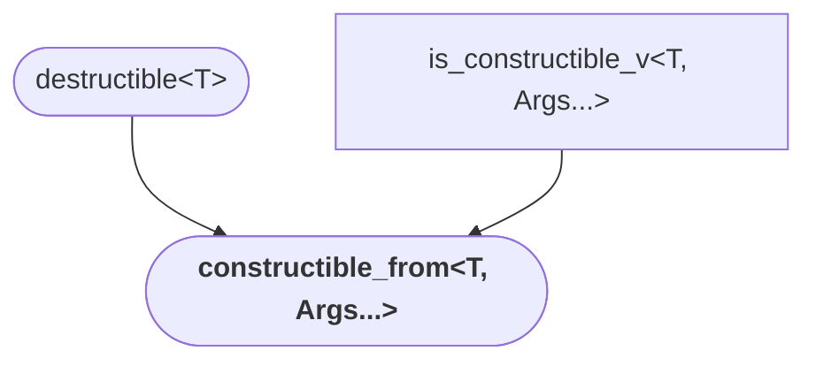


## Concept `default_initializable`
https://timsong-cpp.github.io/cppwp/n4868/concept.default.init

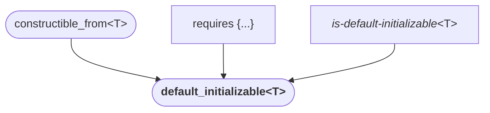


## Concept `move_constructible`
https://timsong-cpp.github.io/cppwp/n4868/concept.moveconstructible

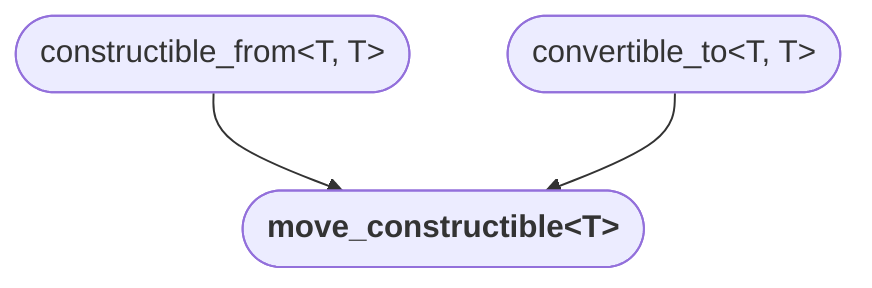


## Concept `copy_constructible`
https://timsong-cpp.github.io/cppwp/n4868/concept.copyconstructible

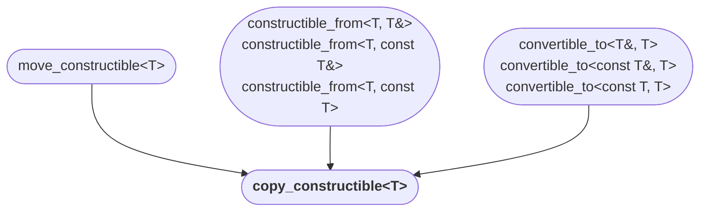


## Boolean testability
https://timsong-cpp.github.io/cppwp/n4868/concept.booleantestable

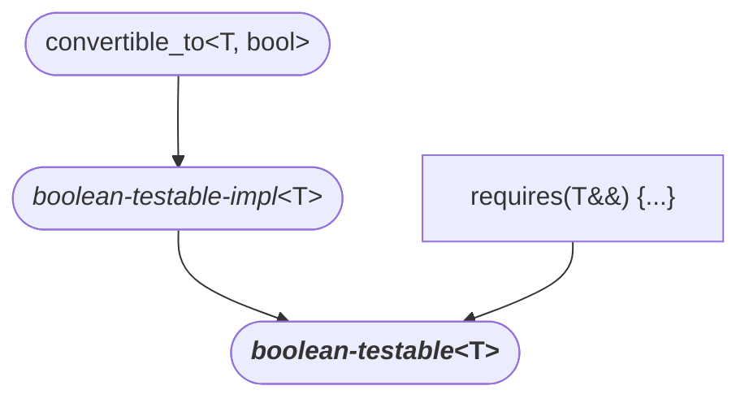


## Concept `equality_comparable`
https://timsong-cpp.github.io/cppwp/n4868/concept.equalitycomparable

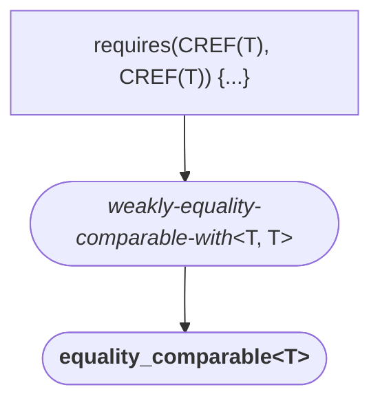

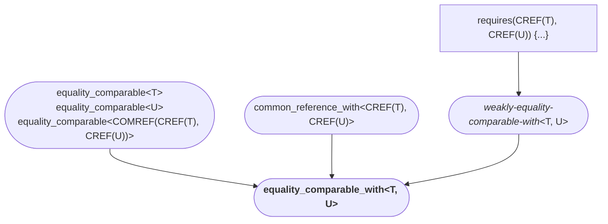


#  Concept `totally_ordered`
https://timsong-cpp.github.io/cppwp/n4868/concept.totallyordered

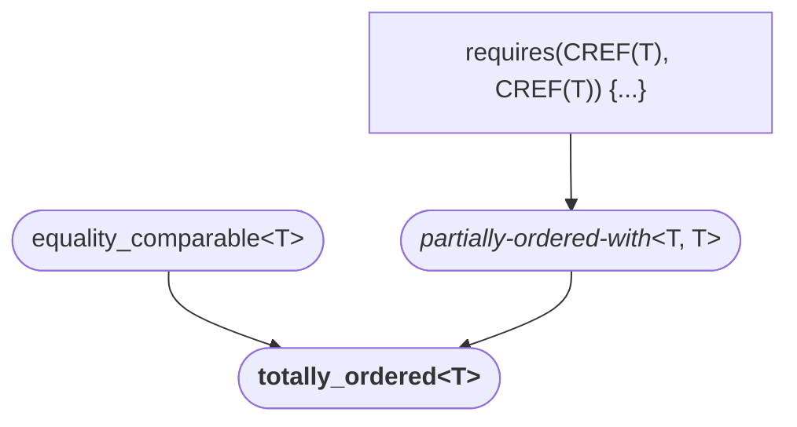

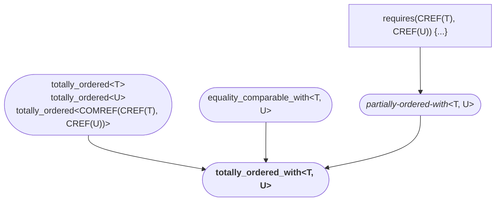


## Object concepts
https://timsong-cpp.github.io/cppwp/n4868/concepts.object

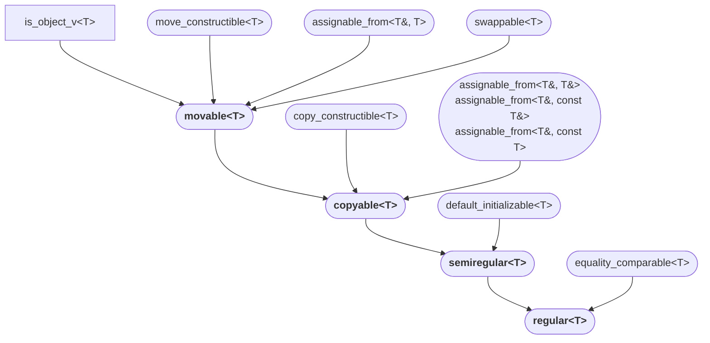


## Concept `invocable`
https://timsong-cpp.github.io/cppwp/n4868/concept.invocable

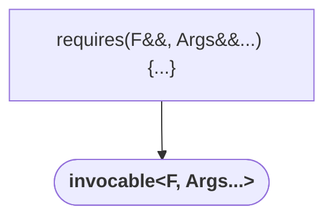


## Concept `regular_invocable`
https://timsong-cpp.github.io/cppwp/n4868/concept.regularinvocable

```mermaid
graph TD
    %% std::regular_invocable<F, Args...>
    invocable(["invocable&lt;F, Args...&gt;"]) --> regular_invocable(["<b>regular_invocable&lt;F, Args...&gt;</b>"]);
```
Note: `regular_invocable` semantically imposes an _equality-preserving_ for `std::invoke` expression.


## Concept `predicate`
https://timsong-cpp.github.io/cppwp/n4868/concept.predicate

```mermaid
graph TD
    %% std::predicate<F, Args...>
    regular_invocable(["regular_invocable&lt;F, Args...&gt;"]) --> predicate(["<b>predicate&lt;F, Args...&gt;</b>"]);
    boolean-testable(["<i>boolean-testable</i>&lt;invoke_result_t&lt;F, Args...&gt;&gt;"]) --> predicate;
```


## Concept `relation`
https://timsong-cpp.github.io/cppwp/n4868/concept.relation

```mermaid
graph TD
    %% std::relation<R, T, U>
    predicate1(["predicate&lt;R, T, T&gt;"]) --> relation(["<b>relation&lt;R, T, U&gt;</b>"]);
    predicate2(["predicate&lt;R, U, U&gt;"]) --> relation;
    predicate3(["predicate&lt;R, T, U&gt;"]) --> relation;
    predicate4(["predicate&lt;R, U, T&gt;"]) --> relation;
```


## Concept `equivalence_relation`
https://timsong-cpp.github.io/cppwp/n4868/concept.equiv

```mermaid
graph TD
    %% std::equivalence_relation<R, T, U>
    predicate(["predicate&lt;R, T, U&gt;"]) --> equivalence_relation(["<b>equivalence_relation&lt;R, T, U&gt;</b>"]);
```
Note: `equivalence_relation` semantically imposes an _equivalence relation_.


## Concept `strict_weak_order`
https://timsong-cpp.github.io/cppwp/n4868/concept.strictweakorder

```mermaid
graph TD
    %% std::strict_weak_order<R, T, U>
    predicate(["predicate&lt;R, T, U&gt;"]) --> strict_weak_order(["<b>strict_weak_order&lt;R, T, U&gt;</b>"]);
```
Note: `strict_weak_order` semantically imposes a _strict weak ordering_.


## Concept `three_way_comparable` (`<compare>`)
https://timsong-cpp.github.io/cppwp/n4868/cmp.concept

```mermaid
graph TD
    %% partially-ordered-with<T, T>
    AC1["requires(CREF(T), CREF(T)) {...}"] --> partially-ordered-with(["<i>partially-ordered-with</i>&lt;T, T&gt;"]);
    %% weakly-equality-comparable-with<T, T>
    AC2["requires(CREF(T), CREF(T)) {...}"] --> weakly-equality-comparable-with(["<i>weakly-equality-comparable-with</i>&lt;T, T&gt;"]);
    %% std::three_way_comparable<T, Cat>
    weakly-equality-comparable-with --> three_way_comparable(["<b>three_way_comparable&lt;T, Cat&gt;</b>"])
    partially-ordered-with --> three_way_comparable
    AC3["requires(CREF(T), CREF(T)) {...}"] --> three_way_comparable
```

```mermaid
graph TD
    %% partially-ordered-with<T, U>
    AC1["requires(CREF(T), CREF(U)) {...}"] --> partially-ordered-with(["<i>partially-ordered-with</i>&lt;T, U&gt;"]);
    %% weakly-equality-comparable-with<T, U>
    AC2["requires(CREF(T), CREF(U)) {...}"] --> weakly-equality-comparable-with(["<i>weakly-equality-comparable-with</i>&lt;T, U&gt;"]);
    %% std::three_way_comparable_with<T, U, Cat>
    three_way_comparable(["three_way_comparable&lt;T, Cat&gt;<br>three_way_comparable&lt;U, Cat&gt;<br>three_way_comparable&lt;COMREF(CREF(T), CREF(U)), Cat&gt;"]) --> three_way_comparable_with(["<b>three_way_comparable_with&lt;T, U, Cat&gt;</b>"])
    common_reference_with(["common_reference_with&lt;CREF(T), CREF(U)&gt;"]) --> three_way_comparable_with
    weakly-equality-comparable-with --> three_way_comparable_with
    partially-ordered-with --> three_way_comparable_with
    AC3["requires(CREF(T), CREF(U)) {...}"] --> three_way_comparable_with
```
